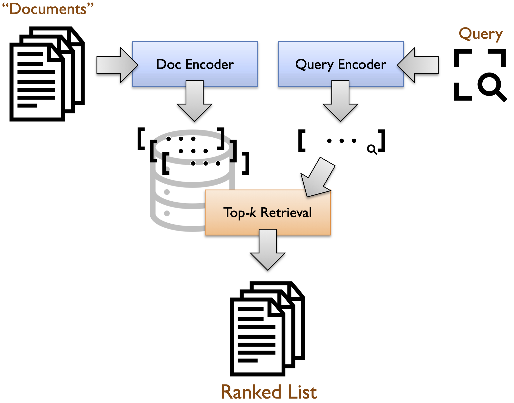

# Pyserini: A Deeper Dive into Learned Sparse Representations

In a [previous guide](conceptual-framework2.md), we introduced a conceptual framework for a representational approach to information retrieval that integrates dense and sparse representations into the same underlying (bi-encoder) architecture.
This guide offers a deeper dive with learned sparse retrieval, where we use SPLADE-v3, a learned sparse model to encode the corpus into sparse vectors, index them into retrieval system with inverted index, and finally perform retrieval and evaluation.

If you're a Waterloo student traversing the [onboarding path](https://github.com/lintool/guide/blob/master/ura.md) (which [starts here](https://github.com/castorini/anserini/blob/master/docs/start-here.md)),
make sure you've first done the previous step, [reproducing a dense retrieval baseline for NFCorpus](experiments-nfcorpus.md).
In general, don't try to rush through this guide by just blindly copying and pasting commands into a shell;
that's what I call [cargo culting](https://en.wikipedia.org/wiki/Cargo_cult_programming).
Instead, really try to understand what's going on.

Following the onboarding path, this lesson does **not** introduce any new concepts.
Rather, the focus is to solidify previously introduced concepts and to connect the bi-encoder architecture to implementations in Pyserini.
Informally, we're "peeling back the covers".

**Learning outcomes** for this guide, building on previous steps in the onboarding path, are divided into three parts.
1. Be able to encode a corpus into its sparse vector representations with SPLADE-v3.
2. Be able to index them into a retrieval system using Lucene inverted index.
3. Be able to compute query-document scores (i.e., retrieval scores) with pyserini for SPLADE retrieval.
4. Be able to perform retrieval with pyserini given a query.

## Recap

As a recap from [here](conceptual-framework.md), this is the "core retrieval" problem that we're trying to solve:

> Given an information need expressed as a query _q_, the text retrieval task is to return a ranked list of _k_ texts {_d<sub>1</sub>_, _d<sub>2</sub>_ ... _d<sub>k</sub>_} from an arbitrarily large but finite collection
of texts _C_ = {_d<sub>i</sub>_} that maximizes a metric of interest, for example, nDCG, AP, etc.

And this is the bi-encoder architecture for tackling the above challenge:



It's all about representations!
BM25 generates bag-of-words sparse lexical vectors where the terms are assigned BM25 weights in an unsupervised manner.
Contriever and BGE-base, which are examples of dense retrieval models, use transformer-based encoders, trained on large amounts of supervised data, that generate _dense_ vectors.

## Learned Sparse Retrieval Models

Now, we're going to basically do the same thing, but with SPLADE-v3 instead of BM25.
A learned sparse model, such as **SPLADE-v3**, extends traditional bag-of-words models like BM25 by incorporating machine learning to optimize term weights and representations. While BM25 relies on fixed, rule-based scoring (e.g., term frequency and inverse document frequency), learned sparse models use neural networks to predict the importance of terms in a query or document, often producing sparse vectors where only the most relevant terms have non-zero weights. This allows learned sparse models to capture semantic relationships and context better than BoW models, which treat terms independently. However, both approaches result in sparse representations, making them efficient for retrieval tasks.

Start by creating the directories where we will store the encoded documents:

```bash
mkdir encode
cd encode
mkdir nfcorpus.splade-v3
```

We can then setup to use SPLADE-v3:
First, we need to request access to SPLADE-v3 model on Hugging Face since it is gated:
1. Create an account for Hugging Face: https://huggingface.co/join
2. Go to the model page on Hugging Face: [Splade-v3](https://huggingface.co/naver/splade-v3)
3. Click the "Log In" button.

Next, we need to authenticate with Hugging Face:
If you don’t already have the Hugging Face CLI installed, install it using:

```bash
pip install huggingface_hub
```

Run the following command to log in to your Hugging Face account:

```bash
huggingface-cli login
```

You’ll be prompted to enter your Hugging Face API token. You can generate a token from your Hugging Face account settings:
1. Go to https://huggingface.co/settings/tokens.
2. Click **"New token"** to generate a token.
3. For your token's permissions, give “Read access to contents of all public gated repos you can access”.
4. Copy the token and paste it into the terminal when prompted.

We are now all set to use SPLADE-v3 model!

Start by running the following command to encode the corpus into sparse vector representations.

```bash
python -m pyserini.encode \
  input --corpus collections/nfcorpus/corpus.jsonl \
        --fields title text \
  output --embeddings encode/nfcorpus.splade-v3 \
  encoder --encoder naver/splade-v3 \
          --encoder-class splade \
          --fields title text \
          --max-length 512
          --batch 32
```
If you encounter a CUDA out-of-memory error, reduce the batch size by decreasing the value of the `batch` parameter.

Next, we will index the encoded corpus using inverted index into a retrieval system.

```bash
python -m pyserini.index.lucene \
  --collection JsonVectorCollection \
  --input encode/nfcorpus.splade-v3 \
  --index index/nfcorpus.splade-v3 \
  --generator DefaultLuceneDocumentGenerator \
  --threads 4 \
  --impact \
  --pretokenized
```
Here, we used pretokenized flag as splade already split the text into tokens (words and subwords) in the sparse vector.

Perform retrieval:

```bash
python -m pyserini.search.lucene \
  --index index/nfcorpus.splade-v3 \
  --topics collections/nfcorpus/queries.tsv \
  --output runs/run.splade.txt \
  --hits 1000 \
  --encoder naver/splade-v3 \
  --remove-query \
  --output-format trec \
  --impact \
  --threads 4
```
The runs will be stored in runs/run.splade.txt.

And evaluate the retrieval run:

```bash
python -m pyserini.eval.trec_eval \
  -c -m ndcg_cut.10 collections/nfcorpus/qrels/test.qrels \
  runs/run.splade.txt
```

The expected results are:

```
ndcg_cut_10           	all	0.3624
```

We can also perform retrieval interactively:

```python
import torch
from pyserini.search.lucene import LuceneImpactSearcher
from pyserini.encode import SpladeQueryEncoder

encoder = SpladeQueryEncoder(model_name_or_path="naver/splade-v3", device='cuda' if torch.cuda.is_available() else 'cpu')
searcher = LuceneImpactSearcher('index/nfcorpus.splade-v3', query_encoder=encoder)
hits = searcher.search('How to Help Prevent Abdominal Aortic Aneurysms')

for i in range(0, 10):
    print(f'{i+1:2} {hits[i].docid:7} {hits[i].score:.6f}')
```

The results should be as follows:

```
 1 MED-4555 51131.000000
 2 MED-4423 36854.000000
 3 MED-3180 30411.000000
 4 MED-1679 30396.000000
 5 MED-3253 29326.000000
 6 MED-2007 28814.000000
 7 MED-1395 28016.000000
 8 MED-5300 27989.000000
 9 MED-4030 27699.000000
10 MED-1194 27588.000000
```
     
To recap, what's the point for this exercise?

+ We see that a machine learning model can also be applied to generate sparse vectors.
+ You now know how to reconstruct the document vector representations.
+ You now know how to encode a query into a query vector.

Okay, that's it for this lesson.
Before you move on, however, add an entry in the "Reproduction Log" at the bottom of this page, following the same format: use `yyyy-mm-dd`, make sure you're using a commit id that's on the main trunk of Pyserini, and use its 7-hexadecimal prefix for the link anchor text.

## Reproduction Log[*](reproducibility.md)

+ Results reproduced by [@JJGreen0](https://github.com/JJGreen0) on 2025-02-16 (commit [`f7ed14d`](https://github.com/castorini/pyserini/commit/f7ed14d145746224be2e09b4046e9140237360ab))
+ Results reproduced by [@lilyjge](https://github.com/lilyjge) on 2025-04-22 (commit [`ba896e2`](https://github.com/lilyjge/pyserini/commit/ba896e217949208fbca88a10708bfad68bfa888f))
+ Results reproduced by [@ricky42613](https://github.com/ricky42613) on 2025-04-25 (commit [`ea70638`](https://github.com/castorini/pyserini/commit/ea70638d56e4346ab8ae9ec205b1e278bcc5afe2))
+ Results reproduced by [@lzguan](https://github.com/lzguan) on 2025-05-02 (commit [`252ee06`](https://github.com/castorini/pyserini/commit/252ee0695c0a533153cd4e769380bbef0edaae7f))
+ Results reproduced by [@mindlesstruffle](https://github.com/mindlesstruffle) on 2025-07-15 (commit [`b5d4838`](https://github.com/castorini/pyserini/commit/b5d48381c171e0ac36cd0c2523fe77b7bfe45435))
+ Results reproduced by [@FarmersWrap](https://github.com/FarmersWrap) on 2025-11-02 (commit [`80395dc`](https://github.com/castorini/pyserini/commit/80395dc7b6e0d5c045f4dcf4ef8e61958ec636ca))
+ Results reproduced by [@minj22](https://github.com/minj22) on 2025-11-05 (commit [`0fc0b62`](https://github.com/castorini/pyserini/commit/0fc0b62246d863dedaa35d0dd4832276aa7fd08b))
+ Results reproduced by [@ipouyall](https://github.com/ipouyall) on 2025-11-05 (commit [`7e54c0e7`](https://github.com/castorini/pyserini/commit/7e54c0e745b073b49fc169ccdda9875cdaa7af85))
+ Results reproduced by [@AdrianGri](https://github.com/adriangri) on 2025-11-12 (commit [`f4a8d0e`](https://github.com/castorini/pyserini/commit/f4a8d0ebfd233d703f1196ba3c679d92ceff51e6))
+ Results reproduced by [@Amirhosseinpoor](https://github.com/Amirhosseinpoor) on 2025-11-13 (commit [`f4a8d0e`](https://github.com/castorini/pyserini/commit/f4a8d0ebfd233d703f1196ba3c679d92ceff51e6))
+ Results reproduced by [@jianxyou](https://github.com/jianxyou) on 2025-11-19 (commit [`7fd6115`](https://github.com/castorini/pyserini/commit/7fd6115779a575729c55dc35bf6101f17e8a6597))
+ Results reproduced by [@xincanfeng](https://github.com/xincanfeng) on 2025-11-19 (commit [`7fd6115`](https://github.com/castorini/pyserini/commit/7fd6115779a575729c55dc35bf6101f17e8a6597))
+ Results reproduced by [@RudraMantri123](https://github.com/RudraMantri123) on 2025-11-28 (commit [`566243c`](https://github.com/castorini/pyserini/commit/566243c80a2d4e3defac98d38c4d07a3b10341f9))
+ Results reproduced by [@Kushion32](https://github.com/Kushion32) on 2025-12-09 (commit [`301db78`](https://github.com/castorini/pyserini/commit/301db7838b13e229fdbe8027d972cefd2122dfdf))
+ Results reproduced by [@MehdiJmlkh](https://github.com/MehdiJmlkh) on 2025-12-10 (commit [`d26c2fd`](https://github.com/castorini/pyserini/commit/d26c2fd224439ca564fe9d2b9e2be580391f1275))
