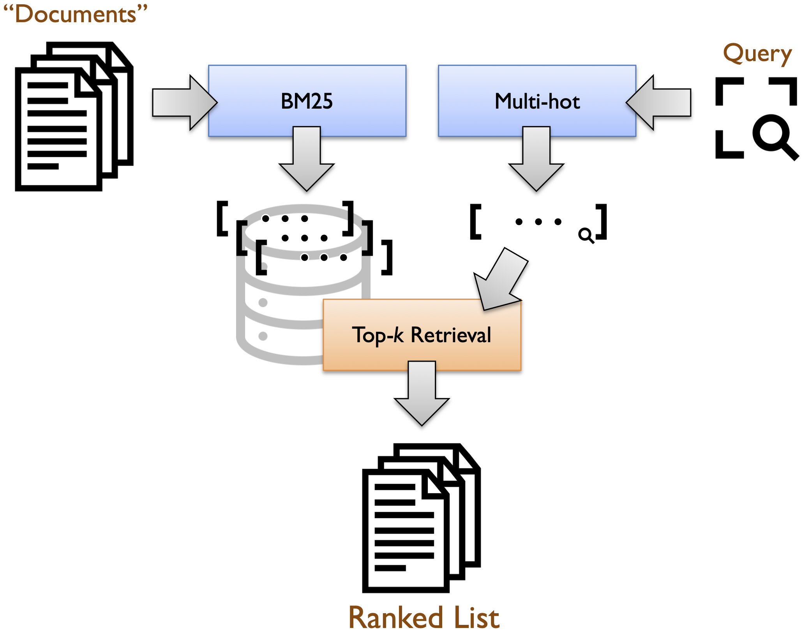
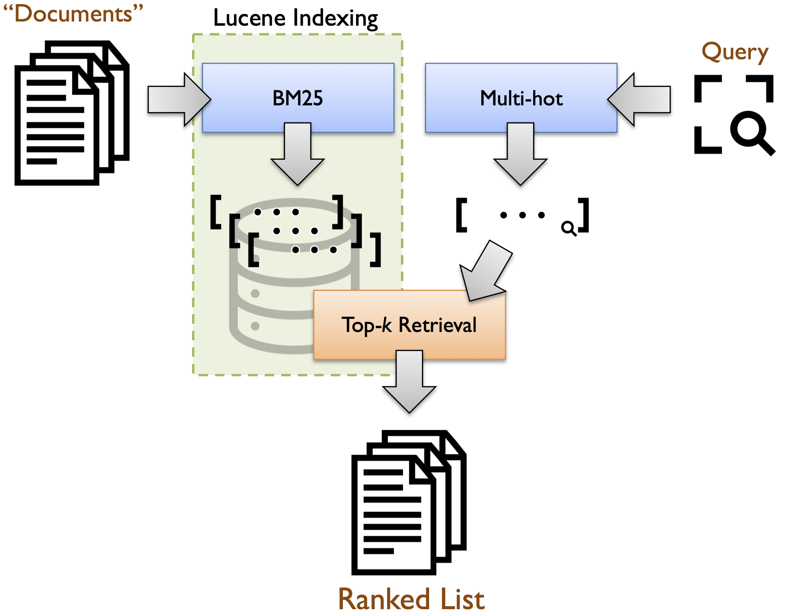
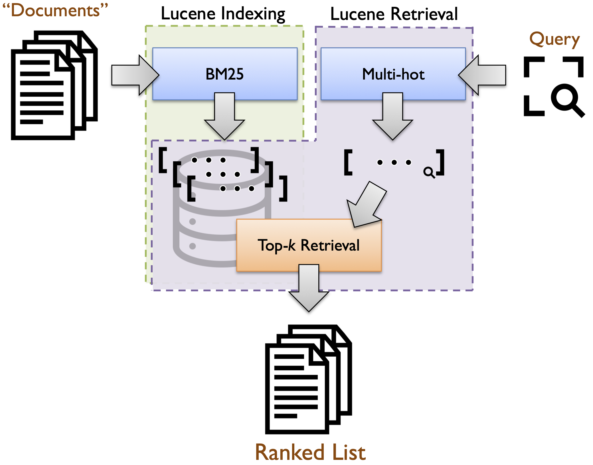

# Pyserini: A Conceptual Model of Retrieval

Known as a bi-encoder (or dual-encoder) architecture:

## BM25 as a Bi-Encoder

Here's BM25 as a bi-encoder:

Here's indexing and retrieval:

## Transformers in Bi-Encoders

Here's dense retrieval:

## Reproduction Log[*](reproducibility.md)

