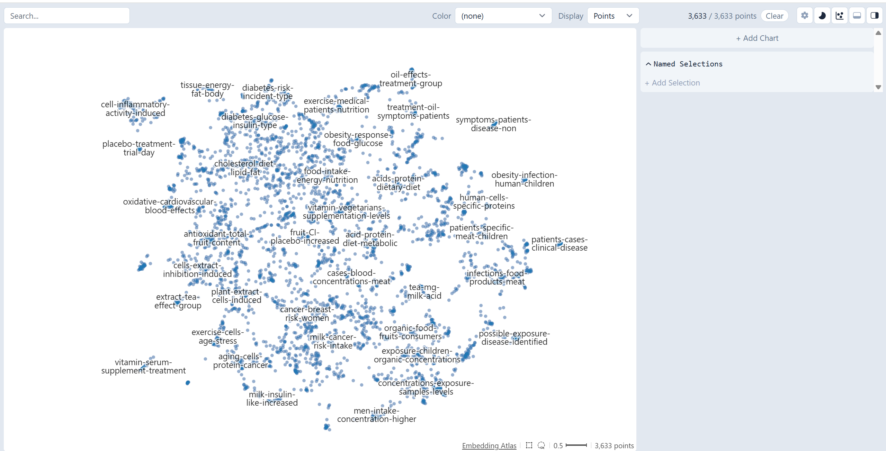

# NFCorpus Atlas Visualization

We can locally create an interactive visualization of NFCorpus using Apple's Embedding Atlas Library. 
This guide will allow us to see how the 3,633 medical documents cluster in 2D space based on their BGE embeddings.

**Important**: Make sure to complete the [BGE-base Baseline for NFCorpus](experiments-nfcorpus.md) first to download the NFCorpus dataset and generate BGE embeddings.

## Install Dependencies

To get started, we need to install dependencies:

```bash
pip install uv datasets pandas
```

## Data Prep

Now let's do some data munging to turn our NFCorpus data to a HuggingFace dataset format:

```python
from datasets import Dataset
import json
import pandas as pd

docs = []
with open('collections/nfcorpus/corpus.jsonl', 'r') as reader:
    for line in reader:
        doc = json.loads(line)
        docs.append({
            'id': doc['_id'],
            'title': doc['title'],
            'text': doc['text'],
            'url': doc['metadata']['url'],
            'full_text': f"{doc['title']} {doc['text']}"
        })

print(f"Loaded {len(docs)} documents")

df = pd.DataFrame(docs)
dataset = Dataset.from_pandas(df)
dataset.to_parquet('nfcorpus.parquet')
```

If you're curious about the HuggingFace Datasets library we are using, see their [documentation](https://huggingface.co/docs/datasets/)

## Atlas Generation

We can generate the atlas visualization:

```bash
uv run https://huggingface.co/datasets/uv-scripts/build-atlas/raw/main/atlas-export.py \
    nfcorpus.parquet \
    --space-name nfcorpus-atlas \
    --text-column full_text \
    --model BAAI/bge-base-en-v1.5 \
    --local-only \
    --output-dir ./nfcorpus-atlas
```

The `--local-only` flag creates the visualization files locally without deploying to a public HuggingFace Space.

## View the Visualization

To see the visualization in your browser, start a local web server:

```bash
cd nfcorpus-atlas
python -m http.server 8000
```

Open `http://localhost:8000` and explore the topics and clusters! 

You can search for specific terms and hover over individual documents to see their content.

Here is an example:



When opening your pull request, be sure to include a screenshot of your visualization!

## Reproduction Log[*](reproducibility.md)

+ Results reproduced by [@suraj-subrahmanyan](https://github.com/suraj-subrahmanyan) on 2025-09-17 (commit [`35a0096`](https://github.com/castorini/pyserini/commit/35a0096ba40f34f0e6da8a7d491f4ccaffbc134a))