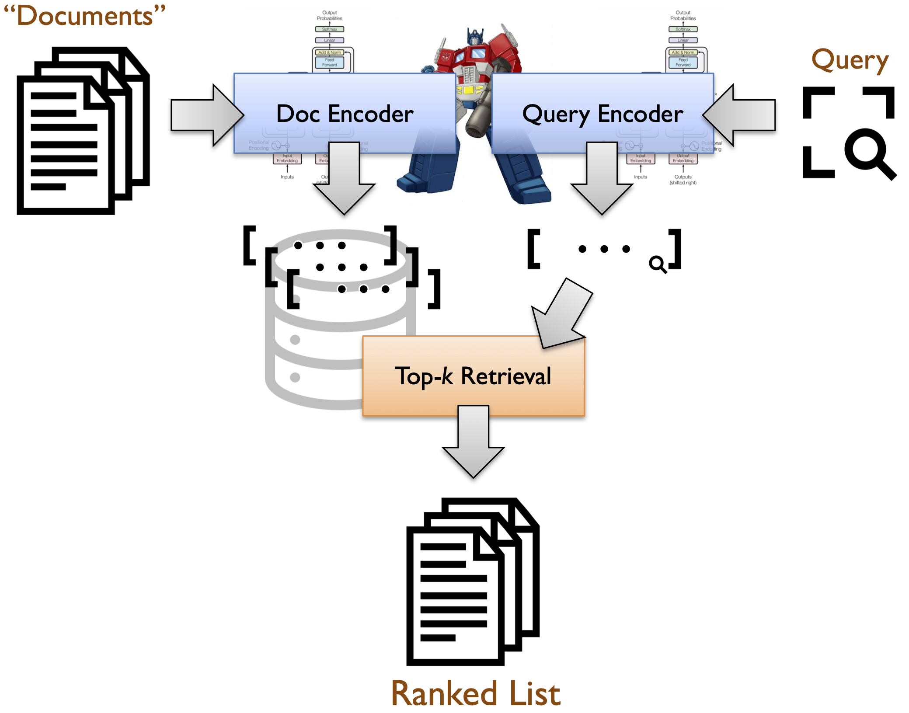

# Pyserini: BGE-base Baseline for NFCorpus

This guide contains instructions for running a BGE-base baseline for NFCorpus.

If you're a Waterloo student traversing the [onboarding path](https://github.com/lintool/guide/blob/master/ura.md) (which [starts here](https://github.com/castorini/anserini/blob/master/docs/start-here.md)),
make sure you've first done the previous step, [a conceptual framework for retrieval](https://github.com/castorini/pyserini/blob/master/docs/conceptual-framework.md).
In general, don't try to rush through this guide by just blindly copying and pasting commands into a shell;
that's what I call [cargo culting](https://en.wikipedia.org/wiki/Cargo_cult_programming).
Instead, really try to understand what's going on.

If you've traversed the onboarding path, by now you've learned the basics of bag-of-words retrieval with BM25 using Lucene (via Anserini and Pyserini).
Conceptually, you understand how it's a specific manifestation of a bi-encoder architecture where the vector representations are _lexical_ and the weights are assigned in an _unsupervised_ (or _heuristic_) manner.

In this guide, we're going to go through an example of retrieval using a _learned_, _dense_ representation.
These are often called "dense retrieval models" and informally referred to as "vector search".
Coming back to here:



The document and query encoders are now transformer-based models that are trained on large amounts of _supervised_ data.
The outputs of the encoders are often called **embedding vectors**, or just **embeddings** for short.

For this guide, assume that we've already got trained encoders.
How to actually train such models will be covered later.

**Learning outcomes** for this guide, building on previous steps in the onboarding path:

+ Be able to use Pyserini to encode documents in NFCorpus with an existing dense retrieval model (BGE-base) and to build a Faiss index on the vector representations..
+ Be able to use Pyserini to perform a batch retrieval run on queries from NFCorpus.
+ Be able to evaluate the retrieved results above.
+ Be able to generate the retrieved results above _interactively_ by directly manipulating Pyserini Python classes.

## Data Prep

In this lesson, we'll be working with [NFCorpus](https://www.cl.uni-heidelberg.de/statnlpgroup/nfcorpus/), a full-text learning to rank dataset for medical information retrieval.
The rationale is that the corpus is quite small &mdash; only 3633 documents &mdash; so the latency of CPU-based inference with neural models (i.e., the encoders) is tolerable, i.e., this lesson is doable on a laptop.
It is not practical to work with the MS MARCO passage ranking corpus using CPUs.

Let's first start by fetching the data:

```bash
wget https://public.ukp.informatik.tu-darmstadt.de/thakur/BEIR/datasets/nfcorpus.zip -P collections
unzip collections/nfcorpus.zip -d collections
```

This just gives you an idea of what the corpus contains:

```bash
$ head -1 collections/nfcorpus/corpus.jsonl
{"_id": "MED-10", "title": "Statin Use and Breast Cancer Survival: A Nationwide Cohort Study from Finland", "text": "Recent studies have suggested that statins, an established drug group in the prevention of cardiovascular mortality, could delay or prevent breast cancer recurrence but the effect on disease-specific mortality remains unclear. We evaluated risk of breast cancer death among statin users in a population-based cohort of breast cancer patients. The study cohort included all newly diagnosed breast cancer patients in Finland during 1995\u20132003 (31,236 cases), identified from the Finnish Cancer Registry. Information on statin use before and after the diagnosis was obtained from a national prescription database. We used the Cox proportional hazards regression method to estimate mortality among statin users with statin use as time-dependent variable. A total of 4,151 participants had used statins. During the median follow-up of 3.25 years after the diagnosis (range 0.08\u20139.0 years) 6,011 participants died, of which 3,619 (60.2%) was due to breast cancer. After adjustment for age, tumor characteristics, and treatment selection, both post-diagnostic and pre-diagnostic statin use were associated with lowered risk of breast cancer death (HR 0.46, 95% CI 0.38\u20130.55 and HR 0.54, 95% CI 0.44\u20130.67, respectively). The risk decrease by post-diagnostic statin use was likely affected by healthy adherer bias; that is, the greater likelihood of dying cancer patients to discontinue statin use as the association was not clearly dose-dependent and observed already at low-dose/short-term use. The dose- and time-dependence of the survival benefit among pre-diagnostic statin users suggests a possible causal effect that should be evaluated further in a clinical trial testing statins\u2019 effect on survival in breast cancer patients.", "metadata": {"url": "http://www.ncbi.nlm.nih.gov/pubmed/25329299"}}
```

We need to do a bit of data munging to get the queries into the right format (from json to tsv).
Run the following Python script:

```python
import json

with open('collections/nfcorpus/queries.tsv', 'w') as out:
    with open('collections/nfcorpus/queries.jsonl', 'r') as f:
        for line in f:
            l = json.loads(line)
            out.write(l['_id'] + '\t' + l['text'] + '\n')
```

Similarly, we need to munge the relevance judgments (qrels) into the right format.
This command-line invocation does the trick:

```bash
tail -n +2 collections/nfcorpus/qrels/test.tsv | sed 's/\t/\tQ0\t/' > collections/nfcorpus/qrels/test.qrels
```

Okay, the data are ready now.

## Indexing

We can now "index" these documents using Pyserini:

```bash
python -m pyserini.encode \
  input   --corpus collections/nfcorpus/corpus.jsonl \
          --fields title text \
  output  --embeddings indexes/nfcorpus.bge-base-en-v1.5 \
          --to-faiss \
  encoder --encoder BAAI/bge-base-en-v1.5 --l2-norm \
          --device cpu \
          --pooling mean \
          --fields title text \
          --batch 32
```

We're using the [`BAAI/bge-base-en-v1.5`](https://huggingface.co/BAAI/bge-base-en-v1.5) encoder, which can be found on HuggingFace.
Use `--device cuda` for a faster computation if you have a CUDA-enabled GPU.

<details>
<summary>Try it using the Contriever model!</summary>
<br/>

```bash
python -m pyserini.encode \
  input   --corpus collections/nfcorpus/corpus.jsonl \
          --fields title text \
  output  --embeddings indexes/faiss.nfcorpus.contriever-msmacro \
          --to-faiss \
  encoder --encoder facebook/contriever-msmarco \
          --device cpu \
          --pooling mean \
          --fields title text \
          --batch 32
```

We're using the [`facebook/contriever-msmarco`](https://huggingface.co/facebook/contriever-msmarco) encoder, which can be found on HuggingFace.
Use `--device cuda` for a faster computation if you have a CUDA-enabled GPU.
</details>
<br/>

Pyserini wraps [Faiss](https://github.com/facebookresearch/faiss/), which is a library for efficient similarity search on dense vectors.
That is, once all the documents have been encoded (i.e., converted into representation vectors), they are passed to Faiss to manage (i.e., for storage and for search later on).
"Index" here is in quotes because, in reality we're using something called a ["flat" index](https://github.com/facebookresearch/faiss/wiki/Faiss-indexes) (`FlatIP` to be exact), which just stores the vectors in fixed-width bytes, one after the other.
At search time, each document vector is sequentially compared to the query vector.
In other words, the library just performs brute force dot products of each query vector against all document vectors.

The above indexing command takes around 30 minutes to run on a modern laptop, with most of the time occupied by performing neural inference using the CPU.
Adjust the `batch` parameter above accordingly for your hardware; 32 is the default, but reduce the value if you find that the encoding is taking too long.

## Retrieval

We can now perform retrieval in Pyserini using the following command:

```bash
python -m pyserini.search.faiss \
  --encoder-class auto --encoder BAAI/bge-base-en-v1.5 --l2-norm \
  --pooling mean \
  --index indexes/nfcorpus.bge-base-en-v1.5 \
  --topics collections/nfcorpus/queries.tsv \
  --output runs/run.beir.bge-base-en-v1.5.nfcorpus.txt \
  --batch 128 --threads 8 \
  --hits 1000
```

(Adjust the `batch` and `threads` parameters above accordingly for your hardware; e.g., lower the settings on a laptop.)

The queries are in `collections/nfcorpus/queries.tsv`.

<details>
<summary>If you indexed with Contriever above, try retrieval with it too:</summary>
<br/>

```bash
python -m pyserini.search.faiss \
  --encoder-class contriever --encoder facebook/contriever-msmarco \
  --index indexes/faiss.nfcorpus.contriever-msmacro \
  --topics collections/nfcorpus/queries.tsv \
  --output runs/run.beir-contriever-msmarco.nfcorpus.txt \
  --batch 128 --threads 8 \
  --hits 1000
```

(Adjust the `batch` and `threads` parameters above accordingly for your hardware; e.g., lower the settings on a laptop.)

</details>
<br/>

As mentioned above, Pyserini wraps the [Faiss](https://github.com/facebookresearch/faiss/) library.
With the flat index here, we're performing brute-force computation of dot products (albeit in parallel and with batching).
As a result, we are performing _exact_ search, i.e., we are finding the _exact_ top-_k_ documents that have the highest dot products.

The above retrieval command takes only a few minutes on a modern laptop.
Adjust the `threads` and `batch` parameters above accordingly for your hardware.

## Evaluation

After the run finishes, we can evaluate the results using `trec_eval`:

```bash
python -m pyserini.eval.trec_eval \
  -c -m ndcg_cut.10 collections/nfcorpus/qrels/test.qrels \
  runs/run.beir.bge-base-en-v1.5.nfcorpus.txt
```
The results will be something like:

```
Results:
ndcg_cut_10           	all	0.3808
```

<details>
<summary>And if you've been following along with Contriever:</summary>
<br/>

```bash
python -m pyserini.eval.trec_eval \
  -c -m ndcg_cut.10 collections/nfcorpus/qrels/test.qrels \
  runs/run.beir-contriever-msmarco.nfcorpus.txt
```

The results will be something like:

```
Results:
ndcg_cut_10           	all	0.3306
```

</details>
<br/>

If you've gotten here, congratulations!
You've completed your first indexing and retrieval run using a dense retrieval model.

## Interactive Retrieval

The final step, as with Lucene, is to learn to use the dense retriever _interactively_.
This contrasts with the _batch_ run above.

Here's the snippet of Python code that does what we want:

```python
from pyserini.search.faiss import FaissSearcher
from pyserini.encode import AutoQueryEncoder

encoder = AutoQueryEncoder('BAAI/bge-base-en-v1.5', device='cpu', pooling='mean', l2_norm=True)
searcher = FaissSearcher('indexes/nfcorpus.bge-base-en-v1.5', encoder)
hits = searcher.search('How to Help Prevent Abdominal Aortic Aneurysms')

for i in range(0, 10):
    print(f'{i+1:2} {hits[i].docid:7} {hits[i].score:.6f}')
```

The `FaissSearcher` provides search capabilities using Faiss as its underlying implementation.
The `AutoQueryEncoder` allows us to initialize an encoder using a HuggingFace model.

```
 1 MED-4555 0.791379
 2 MED-4560 0.710725
 3 MED-4421 0.688938
 4 MED-4993 0.686238
 5 MED-4424 0.686214
 6 MED-1663 0.682199
 7 MED-3436 0.680585
 8 MED-2750 0.677033
 9 MED-4324 0.675772
10 MED-2939 0.674646
```

You'll see that the ranked list is the same as the batch run you performed above:

```bash
$ grep PLAIN-3074 runs/run.beir.bge-base-en-v1.5.nfcorpus.txt | head -10
PLAIN-3074 Q0 MED-4555 1 0.791378 Faiss
PLAIN-3074 Q0 MED-4560 2 0.710725 Faiss
PLAIN-3074 Q0 MED-4421 3 0.688938 Faiss
PLAIN-3074 Q0 MED-4993 4 0.686238 Faiss
PLAIN-3074 Q0 MED-4424 5 0.686214 Faiss
PLAIN-3074 Q0 MED-1663 6 0.682199 Faiss
PLAIN-3074 Q0 MED-3436 7 0.680585 Faiss
PLAIN-3074 Q0 MED-2750 8 0.677033 Faiss
PLAIN-3074 Q0 MED-4324 9 0.675772 Faiss
PLAIN-3074 Q0 MED-2939 10 0.674647 Faiss
```

<details>
<summary>Again with Contriever!</summary>
<br/>

Here's the snippet of Python code that does what we want:

```python
from pyserini.search.faiss import FaissSearcher
from pyserini.encode import AutoQueryEncoder

encoder = AutoQueryEncoder('facebook/contriever-msmarco', device='cpu', pooling='mean')
searcher = FaissSearcher('indexes/faiss.nfcorpus.contriever-msmacro', encoder)
hits = searcher.search('How to Help Prevent Abdominal Aortic Aneurysms')

for i in range(0, 10):
    print(f'{i+1:2} {hits[i].docid:7} {hits[i].score:.6f}')
```

The `FaissSearcher` provides search capabilities using Faiss as its underlying implementation.
The `AutoQueryEncoder` allows us to initialize an encoder using a HuggingFace model.

```
 1 MED-4555 1.472201
 2 MED-3180 1.125014
 3 MED-1309 1.067153
 4 MED-2224 1.059536
 5 MED-4423 1.038440
 6 MED-4887 1.032622
 7 MED-2530 1.020758
 8 MED-2372 1.016142
 9 MED-1006 1.013599
10 MED-2587 1.010811
```

You'll see that the ranked list is the same as the batch run you performed above:

```bash
$ grep PLAIN-3074 runs/run.beir-contriever-msmarco.nfcorpus.txt | head -10
PLAIN-3074 Q0 MED-4555 1 1.472201 Faiss
PLAIN-3074 Q0 MED-3180 2 1.125014 Faiss
PLAIN-3074 Q0 MED-1309 3 1.067153 Faiss
PLAIN-3074 Q0 MED-2224 4 1.059537 Faiss
PLAIN-3074 Q0 MED-4423 5 1.038440 Faiss
PLAIN-3074 Q0 MED-4887 6 1.032622 Faiss
PLAIN-3074 Q0 MED-2530 7 1.020758 Faiss
PLAIN-3074 Q0 MED-2372 8 1.016142 Faiss
PLAIN-3074 Q0 MED-1006 9 1.013599 Faiss
PLAIN-3074 Q0 MED-2587 10 1.010811 Faiss
```

</details>
<br/>

And that's it!

The next lesson will provide [a deeper dive into dense and sparse representations](conceptual-framework2.md).
Before you move on, however, add an entry in the "Reproduction Log" at the bottom of this page, following the same format: use `yyyy-mm-dd`, make sure you're using a commit id that's on the main trunk of Pyserini, and use its 7-hexadecimal prefix for the link anchor text.

## Reproduction Log[*](reproducibility.md)

+ Results reproduced by [@sahel-sh](https://github.com/sahel-sh) on 2023-08-04 (commit [`19da81c`](https://github.com/castorini/pyserini/commit/19da81c04bd4e8d3de3516ae51615f7d52e9cd33))
+ Results reproduced by [@Mofetoluwa](https://github.com/Mofetoluwa) on 2023-08-05 (commit [`6a2088b`](https://github.com/castorini/pyserini/commit/6a2088bae75f87c19d889293a00da87b33cc0ffd))
+ Results reproduced by [@Andrwyl](https://github.com/Andrwyl) on 2023-08-26 (commit [`d9da49e`](https://github.com/castorini/pyserini/commit/d9da49eb3a23fb9daa26399a2e27a5efc73beb71))
+ Results reproduced by [@yilinjz](https://github.com/yilinjz) on 2023-08-30 (commit [`42b3549`](https://github.com/castorini/pyserini/commit/42b354914b230880c91b2e4e70605b472441a9a1))
+ Results reproduced by [@UShivani3](https://github.com/UShivani3) on 2023-09-01 (commit [`42b3549`](https://github.com/castorini/pyserini/commit/42b354914b230880c91b2e4e70605b472441a9a1))
+ Results reproduced by [@Edward-J-Xu](https://github.com/Edward-J-Xu) on 2023-09-05 (commit [`8063322`](https://github.com/castorini/pyserini/commit/806332286d6eacea23061c04205a71698e6a6208))
+ Results reproduced by [@mchlp](https://github.com/mchlp) on 2023-09-07 (commit [`d8dc5b3`](https://github.com/castorini/pyserini/commit/d8dc5b3a1f32fd5d0cebeb711ba148ea967fadbe))
+ Results reproduced by [@lucedes27](https://github.com/lucedes27) on 2023-09-10 (commit [`54014af`](https://github.com/castorini/pyserini/commit/54014af8fe4bf4ba75daba9119acac94c7191cdb))
+ Results reproduced by [@MojTabaa4](https://github.com/MojTabaa4) on 2023-09-14 (commit [`d4a829d`](https://github.com/castorini/pyserini/commit/d4a829d18043783ef3dec2a8adce50e4061ba99a))
+ Results reproduced by [@Kshama](https://github.com/Kshama33) on 2023-09-24 (commit [`7d18f4b`](https://github.com/castorini/pyserini/commit/7d18f4bd3f98d4f901dc061ffd93a1c656e32d0d))
+ Results reproduced by [@MelvinMo](https://github.com/MelvinMo) on 2023-09-24 (commit [`7d18f4b`](https://github.com/castorini/pyserini/commit/7d18f4bd3f98d4f901dc061ffd93a1c656e32d0d))
+ Results reproduced by [@ksunisth](https://github.com/ksunisth) on 2023-09-27 (commit [`142c774`](https://github.com/castorini/pyserini/commit/142c774a303c906ee245913bc7e714b165074b77))
+ Results reproduced by [@maizerrr](https://github.com/maizerrr) on 2023-10-01 (commit [`bdb9504`](https://github.com/castorini/pyserini/commit/bdb9504b1757ab88247924b55a8fde3e5c1a3d20))
+ Results reproduced by [@Stefan824](https://github.com/stefan824) on 2023-10-04 (commit [`4f3da10`](https://github.com/castorini/pyserini/commit/4f3da10b99341d0bc2729590c23d9f1654d8ee37))
+ Results reproduced by [@shayanbali](https://github.com/shayanbali) on 2023-10-13 (commit [`f1d623c`](https://github.com/castorini/pyserini/commit/f1d623cdcb12c3083ff1db8aed4b84e81951a18c))
+ Results reproduced by [@gituserbs](https://github.com/gituserbs) on 2023-10-19 (commit [`f1d623c`](https://github.com/castorini/pyserini/commit/f1d623cdcb12c3083ff1db8aed4b84e81951a18c))
+ Results reproduced by [@shakibaam](https://github.com/shakibaam) on 2023-11-04 (commit [`01889cc`](https://github.com/castorini/pyserini/commit/01889ccb40c5dcc2c6baf629f58db4e6004eeddf))
+ Results reproduced by [@gitHubAndyLee2020](https://github.com/gitHubAndyLee2020) on 2023-11-05 (commit [`01889cc`](https://github.com/castorini/pyserini/commit/01889ccb40c5dcc2c6baf629f58db4e6004eeddf))
+ Results reproduced by [@Melissa1412](https://github.com/Melissa1412) on 2023-11-05 (commit [`acd969f`](https://github.com/castorini/pyserini/commit/acd969f8f234126c272d70d55d047a3804b52ff8))
+ Results reproduced by [@oscarbelda86](https://github.com/oscarbelda86) on 2023-11-13 (commit [`086e16b`](https://github.com/castorini/pyserini/commit/086e16be28b7dc6022f8582dbd803824dc2c1ad2))
+ Results reproduced by [@salinaria](https://github.com/salinaria) on 2023-11-14 (commit [`086e16b`](https://github.com/castorini/pyserini/commit/086e16be28b7dc6022f8582dbd803824dc2c1ad2))
+ Results reproduced by [@aliranjbari](https://github.com/aliranjbari) on 2023-11-15 (commit [`b02ac99`](https://github.com/castorini/pyserini/commit/b02ac9969ba0f509a9cc0ab4b461370b5f35403e))
+ Results reproduced by [@Seun-Ajayi](https://github.com/Seun-Ajayi) on 2023-11-16 (commit [`5d63bc5`](https://github.com/castorini/pyserini/commit/5d63bc5c781a2c89fdb6f46e49a78154383ec031))
+ Results reproduced by [@AndreSlavescu](https://github.com/AndreSlavescu) on 2023-11-28 (commit [`1219cdb`](https://github.com/castorini/pyserini/commit/1219cdbca780e869ba77658c29e1aaa972585d09))
+ Results reproduced by [@tudou0002](https://github.com/tudou0002) on 2023-11-28 (commit [`723e06c`](https://github.com/castorini/pyserini/commit/723e06c3b04e6c6fcd56fcf5bce4386c72503e5a))
+ Results reproduced by [@alimt1992](https://github.com/alimt1992) on 2023-11-29 (commit [`e6700f6`](https://github.com/castorini/pyserini/commit/e6700f6a1bca7d2bea81fb40d9c3ae63c1be142a))
+ Results reproduced by [@golnooshasefi](https://github.com/golnooshasefi) on 2023-11-29 (commit [`1219cdb`](https://github.com/castorini/pyserini/commit/1219cdbca780e869ba77658c29e1aaa972585d09))
+ Results reproduced by [@sueszli](https://github.com/sueszli) on 2023-12-01 (commit [`170e271`](https://github.com/castorini/pyserini/commit/170e271bb8c863b7a45499190bcb8b6b8cfa27f0))
+ Results reproduced by [@kdricci](https://github.com/kdricci) on 2023-12-01 (commit [`a2049c4`](https://github.com/castorini/pyserini/commit/a2049c49124228fe41192a848ec49fbaf391ebee))
+ Results reproduced by [@ljk423](https://github.com/ljk423) on 2023-12-04 (commit [`35002ad`](https://github.com/castorini/pyserini/commit/35002ad21ecb408ced2a96eb09f3a85fc02475ce))
+ Results reproduced by [@saharsamr](https://github.com/saharsamr) on 2023-12-14 (commit [`039c137`](https://github.com/castorini/pyserini/commit/039c137055c429d662544303546d8e225d159be8))
+ Results reproduced by [@Panizghi](https://github.com/Panizghi) on 2023-12-17 (commit [`0f5db95`](https://github.com/castorini/pyserini/commit/0f5db95dbd5ed6b983ac4f638b486a70bc5ea99a))
+ Results reproduced by [@AreelKhan](https://github.com/AreelKhan) on 2023-12-22 (commit [`f75adca`](https://github.com/castorini/pyserini/commit/f75adca8c410e64b3ff1375e181a0ea3af1ddb28))
+ Results reproduced by [@wu-ming233](https://github.com/wu-ming233) on 2023-12-31 (commit [`38a571f`](https://github.com/castorini/pyserini/commit/38a571fb2a61d61d9245997b5d0f8cd64550912c))
+ Results reproduced by [@Yuan-Hou](https://github.com/Yuan-Hou) on 2024-01-02 (commit [`38a571f`](https://github.com/castorini/pyserini/commit/38a571fb2a61d61d9245997b5d0f8cd64550912c))
+ Results reproduced by [@himasheth](https://github.com/himasheth) on 2024-01-10 (commit [`a6ed27e`](https://github.com/castorini/pyserini/commit/a6ed27ec5c9138ea2686d9079909ca7b2fed9d90))
+ Results reproduced by [@Tanngent](https://github.com/Tanngent) on 2024-01-13 (commit [`57a00cf`](https://github.com/castorini/pyserini/commit/57a00cfa6c1201a57eeda13512fee37d72afa348))
+ Results reproduced by [@BeginningGradeMaker](https://github.com/BeginningGradeMaker) on 2024-01-15 (commit [`d4ea011`](https://github.com/castorini/pyserini/commit/d4ea01125ed5d744abc276e70c337e3be1ace260))
+ Results reproduced by [@ia03](https://github.com/ia03) on 2024-01-18 (commit [`05ee8ef`](https://github.com/castorini/pyserini/commit/05ee8eff1f91019e8602b1e4773d3be2816e33de))
+ Results reproduced by [@AlexStan0](https://github.com/AlexStan0) on 2024-01-20 (commit [`833ee19`](https://github.com/castorini/pyserini/commit/833ee19ab76cc5c9cf463eaf3f40838716bbb28b))
+ Results reproduced by [@charlie-liuu](https://github.com/charlie-liuu) on 2024-01-23 (commit [`87a120e`](https://github.com/castorini/pyserini/commit/87a120ebc5dddfe170eaae14fed0e2b1e60f573a))
+ Results reproduced by [@dannychn11](https://github.com/dannychn11) on 2024-01-28 (commit [`2f7702f`](https://github.com/castorini/pyserini/commit/2f7702f2c55cb6f43d9150d3fddd1f3b7b11b0e3))
+ Results reproduced by [@ru5h16h](https://github.com/ru5h16h) on 2024-02-20 (commit [`758eaaa`](https://github.com/castorini/pyserini/commit/758eaaa1c572b6c23ee37d6d3fe897923fbbc690))
+ Results reproduced by [@ASChampOmega](https://github.com/ASChampOmega) on 2024-02-23 (commit [`442e7e1`](https://github.com/castorini/pyserini/commit/442e7e1026728f29cc3a9d3e684c561637ad1d7b))
+ Results reproduced by [@16BitNarwhal](https://github.com/16BitNarwhal) on 2024-02-26 (commit [`19fcd3b`](https://github.com/castorini/pyserini/commit/19fcd3b0ceb5a7d51517ce2fa58dc79b832db6b1))
+ Results reproduced by [@HaeriAmin](https://github.com/haeriamin) on 2024-02-27 (commit [`19fcd3b`](https://github.com/castorini/pyserini/commit/19fcd3b0ceb5a7d51517ce2fa58dc79b832db6b1))
+ Results reproduced by [@17Melissa](https://github.com/17Melissa) on 2024-03-03 (commit [`a9f295f`](https://github.com/castorini/pyserini/commit/a9f295ff0c3b7bccb3808d07cfbdf9058f9c4298))
+ Results reproduced by [@devesh-002](https://github.com/devesh-002) on 2024-03-05 (commit [`84c6742`](https://github.com/castorini/pyserini/commit/84c674275a9a1884ab9f49c523a7d17cd5059c6e))
+ Results reproduced by [@chloeqxq](https://github.com/chloeqxq) on 2024-03-07 (commit [`19fcd3b`](https://github.com/castorini/pyserini/commit/19fcd3b0ceb5a7d51517ce2fa58dc79b832db6b1))
+ Results reproduced by [@xpbowler](https://github.com/xpbowler) on 2024-03-11 (commit [`19fcd3b`](https://github.com/castorini/pyserini/commit/19fcd3b0ceb5a7d51517ce2fa58dc79b832db6b1))
+ Results reproduced by [@jodyz0203](https://github.com/jodyz0203) on 2024-03-12 (commit [`280e009`](https://github.com/castorini/pyserini/commit/280e009c33ce5023a4a9cf97f3478bdf19fec7ba))
+ Results reproduced by [@kxwtan](https://github.com/kxwtan) on 2024-03-12 (commit [`2bb342a`](https://github.com/castorini/pyserini/commit/2bb342acc124c69ec4fe13ebc3be0bd5a5bf497c))
+ Results reproduced by [@syedhuq28](https://github.com/syedhuq28) on 2024-03-28 (commit [`2bb342a`](https://github.com/castorini/pyserini/commit/2bb342acc124c69ec4fe13ebc3be0bd5a5bf497c))
+ Results reproduced by [@khufia](https://github.com/khufia) on 2024-03-29 (commit [`2bb342a`](https://github.com/castorini/pyserini/commit/2bb342acc124c69ec4fe13ebc3be0bd5a5bf497c))
+ Results reproduced by [@Lindaaa8](https://github.com/lindaaa8) on 2024-03-29 (commit [`7dda9f3`](https://github.com/castorini/pyserini/commit/7dda9f3246d791a52ebfcedb0c9c10ee01d4862d))
+ Results reproduced by [@th13nd4n0](https://github.com/th13nd4n0) on 2024-04-05 (commit [`df3bc6c`](https://github.com/castorini/pyserini/commit/df3bc6c2c887d7e3a3a5ee40972600b9ab8cefc2))
+ Results reproduced by [@a68lin](https://github.com/a68lin) on 2024-04-12 (commit [`7dda9f3`](https://github.com/castorini/pyserini/commit/7dda9f3246d791a52ebfcedb0c9c10ee01d4862d))
+ Results reproduced by [@DanielKohn1208](https://github.com/DanielKohn1208) on 2024-04-22 (commit [`184a212`](https://github.com/castorini/pyserini/commit/184a212e7d578fac453ead64f7f796bc2e44bcf2))
+ Results reproduced by [@emadahmed19](https://github.com/emadahmed19) on 2024-04-28 (commit [`9db2584`](https://github.com/castorini/pyserini/commit/9db25847829a656d1c9eacb267bf745f7522dd14))
+ Results reproduced by [@CheranMahalingam](https://github.com/CheranMahalingam) on 2024-05-05 (commit [`f817186`](https://github.com/castorini/pyserini/commit/f8171863df833ac02ff427d4823a1085e63094bf))
+ Results reproduced by [@billycz8](https://github.com/billycz8) on 2024-05-08 (commit [`c945c50`](https://github.com/castorini/pyserini/commit/c945c50c3e22e3c6ecae50a55aed48853617acc0))
+ Results reproduced by [@KenWuqianhao](https://github.com/KenWuqianghao) on 2024-05-11 (commit [`c945c50`](https://github.com/castorini/pyserini/commit/c945c50c3e22e3c6ecae50a55aed48853617acc0))
+ Results reproduced by [@hrouzegar](https://github.com/hrouzegar) on 2024-05-13 (commit [`bf68fc5`](https://github.com/castorini/pyserini/commit/bf68fc59e84ee3ac3c20909a28b6e50cdabc90aa))
+ Results reproduced by [@Yuv-sue1005](https://github.com/Yuv-sue1005) on 2024-05-15 (commit ['9df4015'](https://github.com/castorini/pyserini/commit/9df4015df2554f334e45a9acea066b0e5e8efa22))
+ Results reproduced by [@RohanNankani](https://github.com/RohanNankani) on 2024-05-17 (commit [a91ef1d](https://github.com/castorini/pyserini/commit/a91ef1df102e0d67d8d52061471bff7470186444))
+ Results reproduced by [@IR3KT4FUNZ](https://github.com/IR3KT4FUNZ) on 2024-05-25 (commit [`a6f4d6`](https://github.com/castorini/pyserini/commit/a6f4d6a893aa48aac340fcceb97b0dda7d84b491))
+ Results reproduced by [＠bilet-13](https://github.com/bilet-13) on 2024-06-01 (commit [`b0c53f3`](https://github.com/castorini/pyserini/commit/b0c53f318cea52a425de2e286c42624a3b4da5d9))
+ Results reproduced by [＠SeanSong25](https://github.com/SeanSong25) on 2024-06-05 (commit [`b7e1da3`](https://github.com/castorini/pyserini/commit/b7e1da305dd31b195244d49321087505996260c6))
+ Results reproduced by [＠alireza-taban](https://github.com/alireza-taban) on 2024-06-11 (commit [`d814290`](https://github.com/castorini/pyserini/commit/d814290e846d94ff4d9083afb5da73a491a10a0d))
+ Results reproduced by [＠hosnahoseini](https://github.com/hosnahoseini) on 2024-06-18 (commit [`49d8c43`](https://github.com/castorini/pyserini/commit/49d8c43eebcc6a634e12f61382f17d1ae0729c0f))
+ Results reproduced by [@FaizanFaisal25](https://github.com/FaizanFaisal25) on 2024-07-07 (commit [`3b9d541`](https://github.com/castorini/pyserini/commit/3b9d541b1270dfbe198833dd1fbbdccd2a3d289e))
+ Results reproduced by [＠Feng-12138](https://github.com/Feng-12138) on 2024-07-11(commit [`3b9d541`](https://github.com/castorini/pyserini/commit/3b9d541b1270dfbe198833dd1fbbdccd2a3d289e))
+ Results reproduced by [@XKTZ](https://github.com/XKTZ) on 2024-07-13 (commit [`544046e`](https://github.com/castorini/pyserini/commit/544046ef99e3516ac168a0d1b8de4dc0994ccf31))
+ Results reproduced by [@MehrnazSadeghieh](https://github.com/MehrnazSadeghieh) on 2024-07-19 (commit [`26a2538`](https://github.com/castorini/pyserini/commit/26a2538701a7de417428a705ee5abd8fcafd20dd))
+ Results reproduced by [@alireza-nasirian](https://github.com/alireza-nasirian) on 2024-07-19 (commit [`544046e`](https://github.com/castorini/pyserini/commit/544046ef99e3516ac168a0d1b8de4dc0994ccf31))
+ Results reproduced by [@MariaPonomarenko38](https://github.com/alireza-nasirian) on 2024-07-19 (commit [`d4509dc`](https://github.com/castorini/pyserini/commit/d4509dc5add81573d8a2577c9f2abe25d6a4aab8))
+ Results reproduced by [@valamuri2020](https://github.com/valamuri2020) on 2024-08-02 (commit [`3f81997`](https://github.com/castorini/pyserini/commit/3f81997b7f3999701a3b8efe6911125ca377d28c))
+ Results reproduced by [@daisyyedda](https://github.com/daisyyedda) on 2024-08-06 (commit [`d814290`](https://github.com/castorini/pyserini/commit/d814290e846d94ff4d9083afb5da73a491a10a0d))
+ Results reproduced by [@emily-emily](https://github.com/emily-emily) on 2024-08-16 (commit [`1bbf7a7`](https://github.com/castorini/pyserini/commit/1bbf7a72626866c88e8b21da99d48da6cb43673f))
+ Results reproduced by [@nicoella](https://github.com/nicoella) on 2024-08-19 (commit [`e65dd95`](https://github.com/castorini/pyserini/commit/e65dd952d62d0eb105f24d9f45a961a6c1ad52da))
+ Results reproduced by [@natek-1](https://github.com/natek-1) on 2024-08-19 ( commit [`e65dd95`](https://github.com/castorini/pyserini/commit/e65dd952d62d0eb105f24d9f45a961a6c1ad52da))
+ Results reproduced by [@setarehbabajani](https://github.com/setarehbabajani) on 2024-09-01 (commit [`0dd5fa7`](https://github.com/castorini/pyserini/commit/0dd5fa7e94d7c275c5abd3a35acf64fbeb3013fb))
+ Results reproduced by [@anshulsc](https://github.com/anshulsc) on 2024-09-07 (commit [`2e4fa5d`](https://github.com/castorini/pyserini/commit/2e4fa5ddc8059e0e6655b1db2591f8f069db52fd))
+ Results reproduced by [@r-aya](https://github.com/r-aya) on 2024-09-08 (commit [`2e4fa5d`](https://github.com/castorini/pyserini/commit/2e4fa5ddc8059e0e6655b1db2591f8f069db52fd))
+ Results reproduced by [@Amirkia1998](https://github.com/Amirkia1998) on 2024-09-20 (commit [`83537a3`](https://github.com/castorini/pyserini/commit/83537a32814b20fe7fe6e41e68d61ffea4b1fc5f))
+ Results reproduced by [@pjyi2147](https://github.com/pjyi2147) on 2024-09-20 (commit [`f511655`](https://github.com/castorini/pyserini/commit/f5116554779e48a5be151136a0cbec74a5fad4c0))
+ Results reproduced by [@krishh-p](https://github.com/krishh-p) on 2024-09-21 (commit [`f511655`](https://github.com/castorini/pyserini/commit/f5116554779e48a5be151136a0cbec74a5fad4c0))
+ Results reproduced by [@andrewxucs](https://github.com/andrewxucs) on 2024-09-22 (commit [`dd57b7d`](https://github.com/castorini/pyserini/commit/dd57b7d08934fd635a7f117edf1363eea4405470))
+ Results reproduced by [@Hossein-Molaeian](https://github.com/Hossein-Molaeian) on 2024-09-22 (commit [`bc13901`](https://github.com/castorini/pyserini/commit/bc139014a6e9248d8d7da337e683c8bad190e5dd))
+ Results reproduced by [@AhmedEssam19](https://github.com/AhmedEssam19) on 2024-09-30 (commit [`07f04d4`](https://github.com/castorini/pyserini/commit/07f04d46c78bbae71ee3125d72ad52309d189831))
+ Results reproduced by [@sisixili](https://github.com/sisixili) on 2024-10-01 (commit [`07f04d4`](https://github.com/castorini/pyserini/commit/07f04d46c78bbae71ee3125d72ad52309d189831))
+ Results reproduced by [@alirezaJvh](https://github.com/alirezaJvh) on 2024-10-05 (commit [`3f76099`](https://github.com/castorini/pyserini/commit/3f76099a73820afee12496c0354d52ca6a6175c2))
+ Results reproduced by [@Raghav0005](https://github.com/Raghav0005) on 2024-10-09 (commit [`7ed8369`](https://github.com/castorini/pyserini/commit/7ed83698298139efdfd62b6893d673aa367b4ac8))
+ Results reproduced by [@Pxlin-09](https://github.com/pxlin-09) on 2024-10-26 (commit [`af2d3c5`](https://github.com/castorini/pyserini/commit/af2d3c52953b916e242142dbcf4799ecdb9abbee))
+ Results reproduced by [@Samantha-Zhan](https://github.com/Samantha-Zhan) on 2024-11-17 (commit [`a95b0e0`](https://github.com/castorini/pyserini/commit/a95b0e04a1636e0f4151197c235c961b3c832802))
+ Results reproduced by [@Divyajyoti02](https://github.com/Divyajyoti02) on 2024-11-24 (commit [`f6f8ecc`](https://github.com/castorini/pyserini/commit/f6f8ecc657409504ce5f0794cad1b2111d3c0f60))
+ Results reproduced by [@b8zhong](https://github.com/b8zhong) on 2024-11-24 (commit [`778968f`](https://github.com/castorini/pyserini/commit/778968fd3a4ab7e2e756d9f7e58aca0314bfbf5d))
+ Results reproduced by [@vincent-4](https://github.com/vincent-4) on 2024-11-24 (commit [`576fdaf`](https://github.com/castorini/pyserini/commit/576fdaffb9890beee1cb44c545f27b7110ccbd67))
+ Results reproduced by [@ShreyasP20](https://github.com/ShreyasP20) on 2024-11-28 (commit [`576fdaf`](https://github.com/castorini/pyserini/commit/576fdaffb9890beee1cb44c545f27b7110ccbd67))
+ Results reproduced by [@nihalmenon](https://github.com/nihalmenon) on 2024-11-30 (commit [`94492de`](https://github.com/castorini/pyserini/commit/94492de40203ec2e7b440b703e72677f5a3772fe))
+ Results reproduced by [@zdann15](https://github.com/zdann15) on 2024-12-04 (commit [`5e66e98`](https://github.com/castorini/pyserini/commit/5e66e98863b5929b137bd2eb39d8e4abf6633f23))
+ Results reproduced by [@sherloc512](https://github.com/sherloc512) on 2024-12-05 (commit [`5e66e98`](https://github.com/castorini/pyserini/commit/5e66e98863b5929b137bd2eb39d8e4abf6633f23))
+ Results reproduced by [@Alireza-Zwolf](https://github.com/Alireza-Zwolf) on 2024-12-18 (commit [`6cc23d5`](https://github.com/castorini/pyserini/commit/6cc23d5de4a8f4952156c45d13381a3764640f06))
+ Results reproduced by [@Linsen-gao-457](https://github.com/Linsen-gao-457) on 2024-12-20 (commit [`10606f0`](https://github.com/castorini/pyserini/commit/10606f03de23978877c9b130caf1b2e49c0dc853))
+ Results reproduced by [@robro612](https://github.com/robro612) on 2025-01-05 (commit [`9268591`](https://github.com/castorini/pyserini/commit/9268591dd32df7e19c3c0e476eecbd8bae684e2f))
+ Results reproduced by [@nourj98](https://github.com/nourj98) on 2025-01-07 (commit [`6ac07cc`](https://github.com/castorini/pyserini/commit/6ac07ccfa864220022722f328e074b9078bdb122))
+ Results reproduced by [@mithildamani256](https://github.com/mithildamani256) on 2025-01-13 (commit [`ad41512`](https://github.com/castorini/pyserini/commit/ad4151203c30ab4363dfa3150a37a376d66bd7b7))
+ Results reproduced by [@ezafar](https://github.com/ezafar) on 2025-01-15 (commit [`e1a3386`](https://github.com/castorini/pyserini/commit/e1a33865b4d5e767758f59e320f3b3888fc36346))
+ Results reproduced by [@ErfanSadraiye](https://github.com/ErfanSadraiye) on 2025-01-16 (commit [`cb14c93`](https://github.com/castorini/pyserini/commit/cb14c93e01203dddc950d53a691b3fb79dc34b2e))
+ Results reproduced by [@jazyz](https://github.com/jazyz) on 2025-02-13 (commit [`8c8cc0a`](https://github.com/castorini/pyserini/commit/8c8cc0a1690e2c55d1824b64e64bf0dea781458e))
+ Results reproduced by [@lilyjge](https://github.com/lilyjge) on 2025-02-17 (commit [`8c8cc0a`](https://github.com/castorini/pyserini/commit/8c8cc0a1690e2c55d1824b64e64bf0dea781458e))
+ Results reproduced by [@mohammaderfankabir](https://github.com/mohammaderfankabir) on 2025-02-17 (commit [`8c8cc0a`](https://github.com/castorini/pyserini/commit/8c8cc0a1690e2c55d1824b64e64bf0dea781458e))
+ Results reproduced by [@JJGreen0](https://github.com/JJGreen0) on 2025-02-16 (commit [`8c8cc0a`](https://github.com/castorini/pyserini/commit/8c8cc0a1690e2c55d1824b64e64bf0dea781458e))
+ Results reproduced by [@clides](https://github.com/clides) on 2025-02-18 (commit [`8c8cc0a`](https://github.com/castorini/pyserini/commit/8c8cc0a1690e2c55d1824b64e64bf0dea781458e))
+ Results reproduced by [@Taqvis](https://github.com/Taqvis) on 2025-02-24 (commit [`e67eb0c`](https://github.com/castorini/pyserini/commit/e67eb0ccd3a5ab635430ae923dcd349b4495a109))
+ Results reproduced by [@ricky42613](https://github.com/ricky42613) on 2025-04-25 (commit [`ea70638`](https://github.com/castorini/pyserini/commit/ea70638d56e4346ab8ae9ec205b1e278bcc5afe2))
+ Results reproduced by [@lzguan](https://github.com/lzguan) on 2025-05-01 (commit [`252ee06`](https://github.com/castorini/pyserini/commit/252ee0695c0a533153cd4e769380bbef0edaae7f))
+ Results reproduced by [@Yaohui2019](https://github.com/Yaohui2019) on 2025-05-02 (commit [`252ee06`](https://github.com/castorini/pyserini/commit/252ee0695c0a533153cd4e769380bbef0edaae7f))
+ Results reproduced by [@karush17](https://github.com/karush17) on 2025-05-08 (commit [`4745edc`](https://github.com/castorini/pyserini/commit/4745edc152169df18e1ecaabd920a77ef590432f))
+ Results reproduced by [@YousefNafea](https://github.com/YousefNafea) on 2025-05-02 (commit [`b2aa6af`](https://github.com/castorini/pyserini/commit/b2aa6af25ecc4fbff1eeb700dc5de649d280b1f6))
+ Results reproduced by [@AnthonyZ0425](https://github.com/AnthonyZ0425) on 2025-05-13 (commit [`6b4b22c`](https://github.com/castorini/pyserini/commit/6b4b22cfad1126c721bae55bdde90c928194a6b6))
+ Results reproduced by [@MINGYISU](https://github.com/MINGYISU) on 2025-05-14 (commit [`74dce4f`](https://github.com/castorini/pyserini/commit/74dce4f0fde6b82f22d3ba6a2a798ac4d8033f66))
+ Results reproduced by [@Armd04](https://github.com/Armd04) on 2025-05-16  (commit [`74dce4f`](https://github.com/castorini/pyserini/commit/74dce4f0fde6b82f22d3ba6a2a798ac4d8033f66))
+ Results reproduced by [@Roselynzzz](https://github.com/Roselynzzz) on 2025-05-19 (commit [`74dce4f`](https://github.com/castorini/pyserini/commit/74dce4f0fde6b82f22d3ba6a2a798ac4d8033f66))
+ Results reproduced by [@Cassidy-Li](https://github.com/Cassidy-Li) on 2025-05-20 (commit [`8990ba0`](https://github.com/castorini/pyserini/commit/8990ba069ef8250b8084a8d0107da68880e544bc))
+ Results reproduced by [@AnnieZhang2](https://github.com/AnnieZhang2) on 2025-06-04 (commit [`b180a43`](https://github.com/castorini/pyserini/commit/b180a43b064bdd608b7694bb8601c4f4a40e1a8a))
+ Results reproduced by [@JamesBegin](https://github.com/JamesBegin) on 2025-06-05 (commit [`b180a43`](https://github.com/castorini/pyserini/commit/b180a43b064bdd608b7694bb8601c4f4a40e1a8a))
+ Results reproduced by [@Vik7am10](https://github.com/Vik7am10) on 2025-06-05 (commit [`7d69430`](https://github.com/castorini/pyserini/commit/7d694304a4cc921ab0175f975493c83907234d2e))
+ Results reproduced by [@erfan-yazdanparast](https://github.com/erfan-yazdanparast) on 2025-06-09 (commit [`148c364`](https://github.com/castorini/pyserini/commit/148c364c789f259ceb0f437c68cd8fd05ae9a33d))
+ Results reproduced by [@nahalhz](https://github.com/nahalhz) on 2025-06-09 (commit [`5433c50`](https://github.com/castorini/pyserini/commit/5433c5050312e04abf4153220459fea5ef3424ab))
+ Results reproduced by [@kevin-zkc](https://github.com/kevin-zkc) on 2025-06-10 (commit [`148c364`](https://github.com/castorini/pyserini/commit/148c364c789f259ceb0f437c68cd8fd05ae9a33d))
+ Results reproduced by [@YuvaanshKapila](https://github.com/YuvaanshKapila) on 2025-06-15 (commit [`88584b9`](https://github.com/castorini/pyserini/commit/88584b982ac9878775be1ffb0b1a8673c0cccd3b))
+ Results reproduced by [@sadlulu](https://github.com/sadlulu) on 2025-06-19 (commit [`88584b9`](https://github.com/castorini/pyserini/commit/88584b982ac9878775be1ffb0b1a8673c0cccd3b))
+ Results reproduced by [@adefioye](https://github.com/adefioye) on 2025-06-30 (commit [`2590d4f`](https://github.com/castorini/pyserini/commit/2590d4f6d9b27bb3f0f3170e31bf64553080e895))
+ Results reproduced by [@ed-ward-huang](https://github.com/ed-ward-huang) on 2025-07-07 (commit [`9ec8168`](https://github.com/castorini/pyserini/commit/9ec8168e5ee06842b6cb8f4d4e2bd65edc31b963))
+ Results reproduced by [@OmarKhaled0K](https://github.com/OmarKhaled0K) on 2025-07-09 (commit [`a425dd9`](https://github.com/castorini/pyserini/commit/a425dd9de62374669255e0efdade78892ac983d2))
+ Results reproduced by [@suraj-subrahmanyan](https://github.com/suraj-subrahmanyan) on 2025-07-12 (commit [`9ec8168`](https://github.com/castorini/pyserini/commit/9ec8168e5ee06842b6cb8f4d4e2bd65edc31b963))
+ Results reproduced by [@mindlesstruffle](https://github.com/mindlesstruffle) on 2025-07-14 (commit [`b5d4838`](https://github.com/castorini/pyserini/commit/b5d48381c171e0ac36cd0c2523fe77b7bfe45435))
+ Results reproduced by [@niruhan](https://github.com/niruhan) on 2025-07-18 (commit [`edf8e795`](https://github.com/castorini/pyserini/commit/edf8e795d3d493a48c8e854ab47bd8d1ee9c088b))
+ Results reproduced by [@br0mabs](https://github.com/br0mabs) on 2025-07-25 (commit [`44889de`](https://github.com/castorini/pyserini/commit/44889de3d151b2e1317934b405b3ad6badd81308))
+ Results reproduced by [@goodzcyabc](https://github.com/goodzcyabc) on 2025-08-2 (commit [`44889de`](https://github.com/castorini/pyserini/commit/44889de3d151b2e1317934b405b3ad6badd81308))
+ Results reproduced by [@bikram993298](https://github.com/bikram993298) on 2025-08-21 (commit [`a6b70c8`](https://github.com/castorini/pyserini/commit/a6b70c8759d60dc376a0b7ce66e9dcea2f851796))
+ Results reproduced by [@JoshElkind](https://github.com/JoshElkind) on 2025-08-24 (commit [`4490f7b`](https://github.com/castorini/pyserini/commit/4490f7b1162c130309ad36cbb27fe16787026f3d))
+ Results reproduced by [@Dinesh7K](https://github.com/Dinesh7K) on 2025-09-04 (commit [`e6617ad`](https://github.com/castorini/pyserini/commit/b09c7869e07d41ae5b348ac69063914207e6617a))
+ Results reproduced by [@FarmersWrap](https://github.com/FarmersWrap) on 2025-09-09 (commit [`4a3616d`](https://github.com/castorini/pyserini/commit/4a3616d8925eb834563f11c3075926b65071c28b))
+ Results reproduced by [@NathanNCN](https://github.com/NathanNCN) on 2025-09-10 (commit [`b09c786`](https://github.com/castorini/pyserini/commit/b09c7869e07d41ae5b348ac69063914207e6617a))
+ Results reproduced by [@CereNova](https://github.com/CereNova) on 2025-09-15 (commit [`abcb05d`](https://github.com/castorini/pyserini/commit/abcb05d451e948e16067633c867de60ea62ea27a))
+ Results reproduced by [@ShivamSingal](https://github.com/ShivamSingal) on 2025-09-16 (commit [`d8be989`](https://github.com/castorini/pyserini/commit/d8be989a4e5cd7adbd310dcef52a149c42764552))
+ Results reproduced by [@shreyaadritabanik](https://github.com/shreyaadritabanik) on 2025-09-18 (commit [`4189efe`](https://github.com/castorini/pyserini/commit/4189efe9b1f936eda9d4142a039d146d9341deb6))
+ Results reproduced by [@mahdi-behnam](https://github.com/mahdi-behnam) on 2025-09-20 (commit [`bb9dbed`](https://github.com/castorini/pyserini/commit/bb9dbeda8ceda4d8037a17a0827b292ab727b1fb))
+ Results reproduced by [@k464wang](https://github.com/k464wang) on 2025-09-21 (commit [`6ceefc1`](https://github.com/castorini/pyserini/pull/2257/commits/6ceefc11110eff6ee1632d5d359036c210c29cae))
+ Results reproduced by [@rashadjn](https://github.com/rashadjn) on 2025-09-25 (commit [`9815d56`](https://github.com/castorini/pyserini/commit/9815d56eb4e41a62d59e41cbd49af25c6a907338))
+ Results reproduced by [@samin-mehdizadeh](https://github.com/samin-mehdizadeh) on 2025-09-29 (commit [`b853071`](https://github.com/castorini/pyserini/commit/b853071b2fff4ee8951e8fce455ad61ace893b57))
+ Results reproduced by [@AniruddhThakur](https://github.com/AniruddhThakur) on 2025-10-06 (commit [`5de309a`](https://github.com/castorini/pyserini/commit/5de309ad6ca5129b62d611cd33d38e4d8bf4c66d))
+ Results reproduced by [@prav0761](https://github.com/prav0761) on 2025-10-13 (commit [`322d95d`](https://github.com/castorini/pyserini/commit/322d95d67621862ff5ddee4b398155cc5b1b68fc))
+ Results reproduced by [@henry4516](https://github.com/henry4516) on 2025-10-14 (commit [`42e97dc`] (https://github.com/castorini/pyserini/commit/42e97dcb9bef044c91ec4f5191995cee98b4e47b))
+ Results reproduced by [@InanSyed](https://github.com/InanSyed) on 2025-10-15 (commit [`eca61d9`](https://github.com/castorini/pyserini/commit/eca61d948721b7a1ab4ccda55d5d3e66f419dfef))
+ Results reproduced by [@yazdanzv](https://github.com/yazdanzv) on 2025-10-15 (commit [`cd45e54`](https://github.com/castorini/pyserini/commit/cd45e5488f269cbd3d77722e788d51fd2dc26671))
+ Results reproduced by [@ivan-0862](https://github.com/ivan-0862) on 2025-10-25 (commit [`8237181`](https://github.com/castorini/pyserini/commit/8237181239312494b2acaf514856598098c9923d))
+ Results reproduced by [@brandonzhou2002](https://github.com/brandonzhou2002) on 2025-10-27 (commit [`d9d1a48`](https://github.com/castorini/pyserini/commit/d9d1a48d2437c1c6d6aa875ea468162d62501efc))
+ Results reproduced by [@royary](https://github.com/royary) on 2025-10-27 (commit [`d9d1a48`](https://github.com/castorini/pyserini/commit/d9d1a48d2437c1c6d6aa875ea468162d62501efc))
+ Results reproduced by [@Raptors65](https://github.com/Raptors65) on 2025-10-28 (commit [`8237181`](https://github.com/castorini/pyserini/commit/8237181239312494b2acaf514856598098c9923d))
