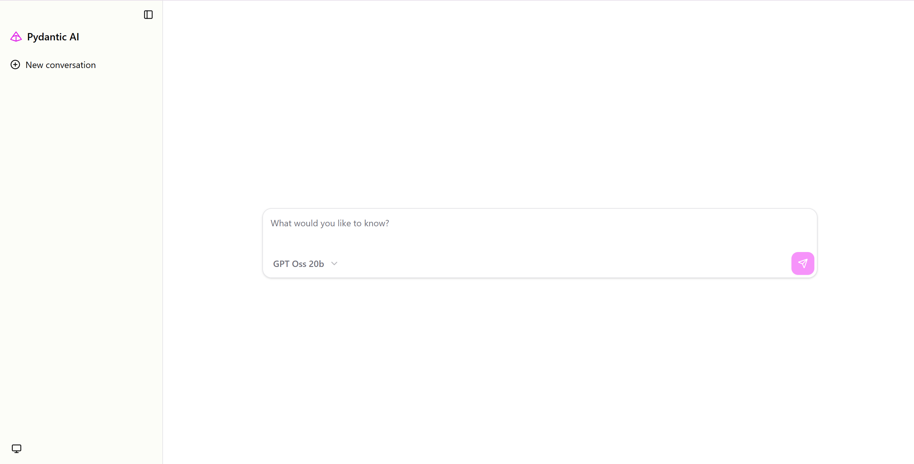

# MCP Client for RAG

This guide goes through setting up and running a lightweight, custom MCP client for RAG.
This client can be used with any MCP server, not just that of Pyserini's. 

# MCP Server

To setup the MCP servers, install Pyserini through this [guide](https://github.com/castorini/pyserini/blob/master/docs/installation.md) and follow [this](https://github.com/castorini/pyserini/blob/master/docs/usage-mcp.md) to start the Pyserini MCP server.

The script assumes the MCP server is running at http://localhost:8000/mcp with streamable-http as the transport.
This is also the default port for Pyserini's MCP server, though you can specify another port with command line arguments.
If the server is at a different endpoint, update the URL in the script correspondingly. 

# LLM

The script assumes a locally running instance of OpenAI's GPT-OSS-20B.
It also assumes that the instance is reachable on http://localhost:6000/v1.
If this is not the case, update the endpoint correspondingly. 

Here is an example command to serve this model through vLLM:

```bash
vllm serve openai/gpt-oss-20b --tool-call-parser openai --enable-auto-tool-choice --port 6000
```

To check that the model is running properly, run the following. 
You should see a list of available models, which in this case, is just GPT-OSS-20B.

```bash
curl http://localhost:6000/v1/models
```

# Client 

To start, create a virtual environment and install dependencies.

```bash
conda create -n agent python=3.12 -y
conda activate agent

pip install pydantic-ai clai
```

To run the client and interact with it through a web UI:

```bash
clai web --agent rag_agent:agent
```

Navigate to http://127.0.0.1:7932 in your browser and you should see the following:



You're ready to go!